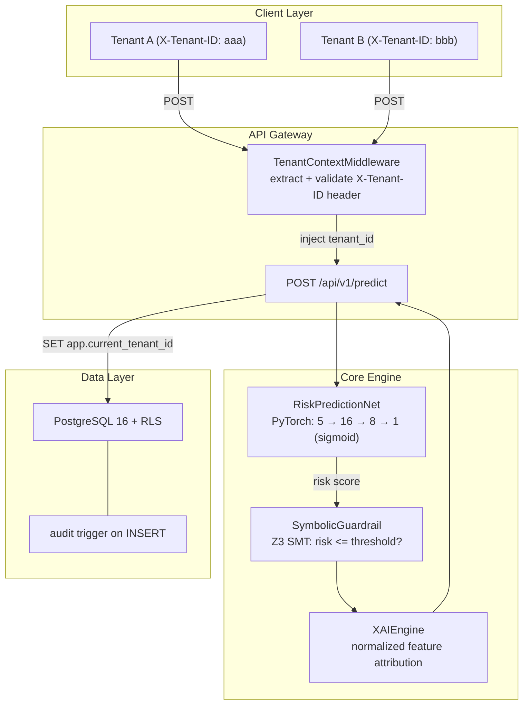
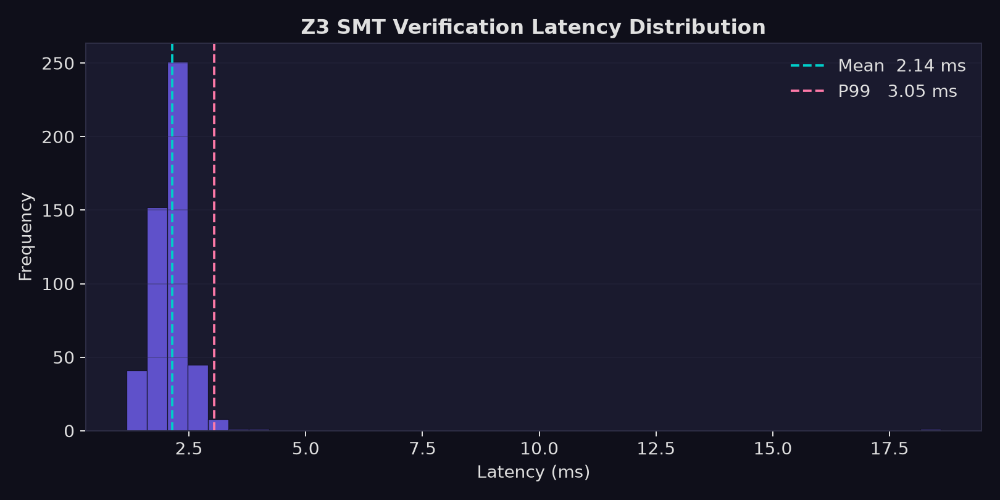
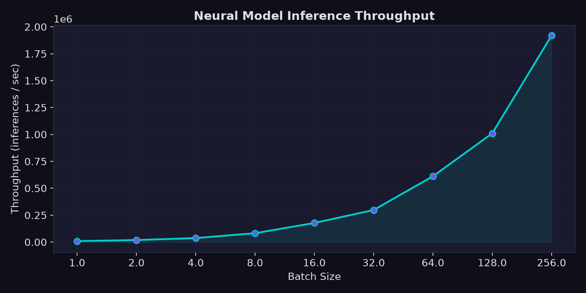
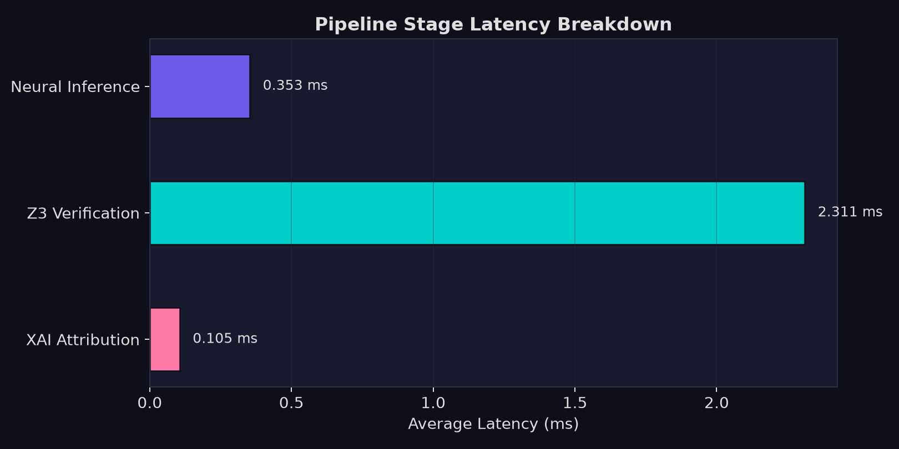
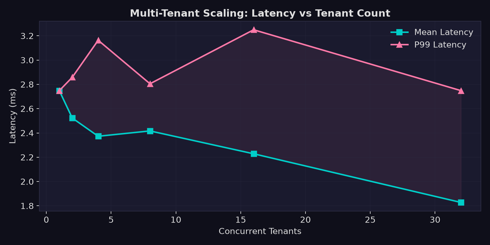

# Aether-XAI


A university project exploring whether you can combine a neural network with a formal constraint solver to make AI predictions more trustworthy and auditable — specifically in a multi-tenant setting where different clients have different risk tolerance rules.

The short version: a FastAPI backend takes feature vectors from tenants, runs them through a PyTorch model to get a risk score, then passes that score to the Z3 SMT solver to formally verify it doesn't violate the tenant's rules. There's also lightweight feature attribution (not full SHAP — more on that in [Notes](#notes)) so you can see what drove the prediction. Tenant data is isolated using PostgreSQL Row-Level Security so one tenant can't see another's audit records.

This came out of a course on distributed systems and I ended up going deeper on the neuro-symbolic side than originally planned. It's not production-ready but the core ideas work.

---

## How it fits together



Each request runs through the model to get a risk score, gets checked against the tenant's threshold in Z3, then gets a quick attribution pass so the prediction isn't a total black box. All of that lives in `core/`.

---

## Multi-tenant isolation

The tricky part was making sure tenant A can never read tenant B's data even if they hit the same API. The approach here uses Postgres RLS — the middleware reads the `X-Tenant-ID` header, the route sets `app.current_tenant_id` as a session variable, and the RLS policy on `ml_inference_audits` automatically filters every query to that tenant's rows.

I'll be honest — the RLS and audit-trigger pattern here is adapted from a multi-tenant backend I built for an earlier project. I'd already tested it there and knew it worked, so I reused the same approach rather than designing something from scratch. Seemed better than reinventing it.

One thing that tripped me up: getting Z3's Python bindings to install cleanly alongside PyTorch in the same venv was surprisingly annoying. Ended up pinning `z3-solver==4.12.6.0` in requirements because newer versions had some incompatibility with the numpy version PyTorch pulls in. Might not affect everyone but it definitely wasted an afternoon for me.

---

## Benchmarks

I ran these locally to get a feel for where the latency is actually going. Z3 is the slow part — SMT solving isn't cheap, and you can see that in the pipeline breakdown. The model itself is tiny so inference is basically free.

To run them yourself:

```bash
pip install matplotlib
python benchmarks/generate_graphs.py
```

### Z3 verification latency (500 runs)

<p align="center">
  
</p>

Mean ~2.1ms, P99 ~3ms. Most of that is Z3 initialization overhead per call — probably avoidable with a persistent solver instance but I haven't looked into it yet.

### Inference throughput

<p align="center">
  
</p>

The model scales fine with batch size. This is CPU-only, no GPU used.

### Pipeline breakdown

<p align="center">
  
</p>

Z3 dominates. Neural inference is ~0.35ms, attribution is ~0.1ms. Total end-to-end is around 2.7ms.

### Tenant scaling

<p align="center">
  
</p>

Per-request latency stays roughly flat as tenant count increases — isolation is enforced at the DB level so there's no per-tenant overhead in the application layer.

---

## Trying it out

Start the API:

```bash
git clone https://github.com/ramzanhasnain4-dotcom/aether-xai.git
cd aether-xai
pip install -r requirements.txt
uvicorn api.main:app --reload
```

Send a prediction (constraint passes):

```bash
curl -X POST http://localhost:8000/api/v1/predict \
  -H "Content-Type: application/json" \
  -H "X-Tenant-ID: 11111111-1111-1111-1111-111111111111" \
  -d '{"features": [0.1, 0.2, 0.3, 0.1, 0.2], "max_risk_threshold": 0.95}'
```

```json
{
  "tenant_id": "11111111-1111-1111-1111-111111111111",
  "raw_prediction": 0.5073,
  "constraint_passed": true,
  "status_message": "SATISFIED: Risk 0.5073 <= threshold 0.9500",
  "attributions": {"f1": 0.1111, "f2": 0.2222, "f3": 0.3333, "f4": 0.1111, "f5": 0.2222}
}
```

Same request but with a tight threshold (constraint fails):

```bash
curl -X POST http://localhost:8000/api/v1/predict \
  -H "Content-Type: application/json" \
  -H "X-Tenant-ID: 22222222-2222-2222-2222-222222222222" \
  -d '{"features": [0.9, 0.8, 0.7, 0.95, 0.85], "max_risk_threshold": 0.30}'
```

```json
{
  "raw_prediction": 0.5312,
  "constraint_passed": false,
  "status_message": "VIOLATION: Risk 0.5312 exceeds max threshold 0.3000"
}
```

Missing the header returns 400 immediately — the middleware rejects it before anything else runs.

### Docker

```bash
docker-compose up --build
```

Spins up the API + Postgres 16 with the schema from `schema/`. API at `localhost:8000`, docs at `/docs`. I haven't set up any persistent volumes so the DB resets every time you tear it down — meant to fix this but haven't gotten around to it.

---

## Tests

```bash
pytest tests/ -v
```

Tests cover the API endpoints, Z3 pass/fail/boundary cases, and isolation logic. CI runs on every push.

---

## Project layout

```
aether-xai/
├── api/
│   ├── main.py            # app setup, middleware registration
│   ├── middleware.py      # tenant header extraction
│   └── routes.py          # /api/v1/predict
├── core/
│   ├── neural_model.py    # RiskPredictionNet
│   ├── symbolic_verifier.py  # Z3 guardrail
│   └── explainability.py  # feature attribution
├── benchmarks/
│   ├── latency_test.py
│   ├── generate_graphs.py
│   └── graphs/
├── schema/
│   ├── 01_init.sql        # tables + RLS policy
│   └── 02_audit_triggers.sql
├── tests/
├── Dockerfile
└── docker-compose.yml
```

---

## Notes

The Z3 integration is the part I'm most interested in here — using an SMT solver to formally verify model outputs is a bit different from just post-processing a score with a threshold check. The guarantee is stronger: if Z3 says `sat`, the constraint is mathematically satisfied given the inputs, not just within floating point tolerance.

The attribution in `explainability.py` is a simplified version — it just normalizes the absolute feature values to show relative contribution. It's not real Shapley game-theoretic attribution, which would require many more model calls. Good enough for showing which features matter directionally, but I wouldn't call it SHAP.

RLS setup is in `schema/01_init.sql` if you want to see how the policy is written.
